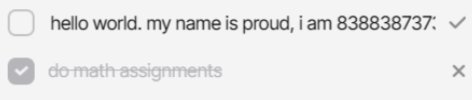

<b>shinsouhitoshi1203</b>
# naming regulation for todos web application

> prefix: `todos` [obviously]

## 1. todos header

## 2. todos item

### a. item's properties

#### ・ attribute: `todos-item-status`
> indicate the status of an items

this attribute only provides two values
1. `active`: a todo that hasn't been checked (aka.) *active*
2. `done`: a todo that has been checked (aka.) *completed*

#### ・ attribute: `todos-item-mode`
> indicate if the item is being edited. 

this attribute only provides two values
1. `normal`: there is no edit request, a `span` will be displayed.
2. `edit`: currently editing stuff, `edit txtbox` will be displayed.

### b. buttons
> buttons: all buttons declared in a <b><i>todo</i></b>

attribute: `todos-item-command`

| command name *{in string}* | description | only makes sense w/ |
| --------------- | --------------- | --------------- |
| `delete` | delete a todo, whether it's checked or not. | *todos-item-status*: `all` |
| `edit` | confirm changes of a todo's name | *todos-item-status*: `active`   *todos-item-mode*: `edit` |
| `check` | confirm changes of a todo's name | *todos-item-status*: `active` |

